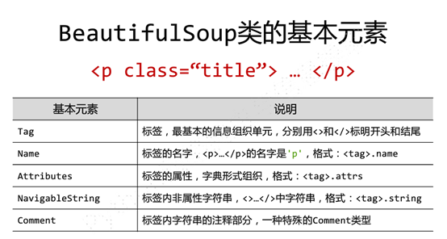
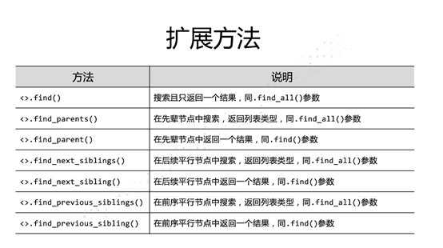
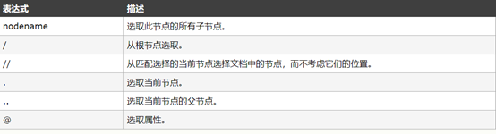
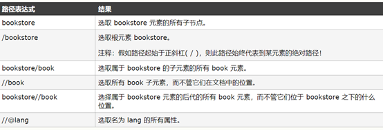

# Bs4查找
我们在这里先介绍BeautifulSoup的基本元素以及如何访问这些元素



为什么会有name这个奇葩的获取方式呢,因为假如用了循环遍历以后我们就根本不能判断下一个标签的名字，且不说这个，就算是<tag>.parent.parent我们都不能知道这个标签的名字。
r.text的内容经过解析器解析之后才能用BeautifulSoupl的一些处理方法，和一些循环遍历，提取子节点的方法
无过滤查找
基于BS4库的循环遍历方法（通过标签的属性来来实现
一、	下行遍历

将`<tag>`存储到列表后还是能用`<tag>`还是能用标签树的全部标签，因为存到列表里并不影响`<tag>`的type类型。
用法：

```python
for child in soup.body.children 
	print(child)
for child in soup.body.descendants:
	print(child):
```


二、	上行遍历

```go
for parent in soup.a.parents :
	if parent is None :
		print(parent)
	else :	
		print(parent.name)
```


三、	平行遍历

```python
for sibling in soup.a.next_sibling：
 	print(sibling)
for sibling in soup.a.previous_sibling :
	print(sibling)
```


Bs4的prettify()方法能让html给我们比较好看

注：bs4库将任何html输入都变成utf-8编码
有过滤查找
基于bs4库的信息提取方法
（对xml,json,yaml有不同的提取方法但本质上是相同的，我们在这里先说下xml的信息提取方法）

`<>.find_all(name,attrs,recursive,string,**kwargs)`
Name是对标签的名字进行查找，如soup.find_all(‘a’),返回的是一个列表类型，每个元素的最外层是`<a>`类型。
1. Attrs的使用方法
  1. 直接使用<>,find_all(attrs={})
  2. 间接使用<>.find_all(id=””)
2.	,recursive是否对子孙全部检索recursive=True/Faulse
3.	String是<>…<>里面的…。使用方式：soup.find_all(string=re.compile(“B”)
4.	注：我们也可以写简便方式：<tag>(……)=<tag>.find_all



注：我们这里可以将string类型通过BeautifulSoup进行解析，得到标签树，不过得到的标签树可能是不完整的，但是我们也可以用bs4库的相关操作
`<tag>.find_all()`是结果必须有两个，如果结果只有一个，那么我们就不能直接用`find_al()`去当列表，后面必须有[0]
我们如何删除其他数据，

```
1.	 if isinstance(tr, bs4.element.Tag):
2.	 		tds = tr('td')
3.	     	ulist.append([tds[0].string, tds[1].string, tds[3].strin)
```
我们可以通过这个方法来删掉不是我们想要的数据
获取文本
获取一个标签内的文本 tag.string
获取多个标签内的文本tag.get_text()
bs4与正则的连用 soup.find_all(string=re.compile(“B”)获取到有B的字符数组
我们也可以利用python的异常处理机制
```
1.	 try:
2.	            if html=="":
3.	                continue
4.	            infoDict = {}
5.	            soup = BeautifulSoup(html, 'html.parser')
6.	            stockInfo = soup.find('div',attrs={'class':'stock-bets'})
7.	 
8.	            name = stockInfo.find_all(attrs={'class':'bets-name'})[0]
9.	            infoDict.update({'股票名称': name.text.split()[0]})
10.	             
11.	            keyList = stockInfo.find_all('dt')
12.	            valueList = stockInfo.find_all('dd')
13.	            for i in range(len(keyList)):
14.	                key = keyList[i].text
15.	                val = valueList[i].text
16.	                infoDict[key] = val
17.	             
18.	            with open(fpath, 'a', encoding='utf-8') as f:
19.	                f.write( str(infoDict) + '\n' )
20.	                count = count + 1
21.	                print("\r当前进度: {:.2f}%".format(count*100/len(lst)),end="")
22.	        except:
23.	            count = count + 1
24.	            print("\r当前进度: {:.2f}%".format(count*100/len(lst)),end="")
25.	            continue
```
这两个方法都是很不错的方法

返回的都是bs4类型

# xpath
## xpath路径表达式






## nodename
可以这样理解nodename是不能单独用的，这个和@是一样的，去规定哪些值。比如response.xpath(“/nodename”)就是获取到第一个节点，而不能这样用。response.xpath(“nodename”)。
## “/” 进一层
”/”可以看成在标签树中更深一层。如下所示

```
<!DOCTYPE html>
/<html>
    <head>
        <title>
        </title>
    </head>
    <body>
        <div>
            <p>
            </p>
        </div>
    </body>
</html>
```
response=response.xpath(“/html”)，response是获取到深入的一层。
到达了这一层

```
<html>
    /<head>
        <title>
        </title>
    </head>
    <body>
        <div>
            <p>
            </p>
        </div>
    </body>
</html>
```
可以将“/“理解成”<”,将/nodename理解成<nodename 运行掉/nodename就到了这里了nodename>
## “//“任意层
可以理解成任意节点，一般是这样用的response.xpath(“.//*)表示获取到该节点下的所有子节点。
“..”表示父亲节点
## “@”选取属性
response.xpath(“//p/@key)选区p标签的key属性值

## 获取文本

+ 获取一个标签内的文本response.xpath(“//p/text()”)获取p标签的文本

+ 标签内的文本response.xpath(“string(.)”).获取response的子节点内的所有文本

  

## 谓语表达式[]
是用来过滤的
```
匹配属性response.xpath(“//*[@class])
匹配固定的属性值response.xpath(“//*[@key=Value])
匹配多个属性值 response.xpath(“//*[contains(@class,””)])
匹配多属性 response.xpath(“//*[contains(@class,””) and contains(@class,””) ])
运算符  or and mod | ……
按序选择：采用了切片，如response.xpath(“//li[1]/s/text())
```
