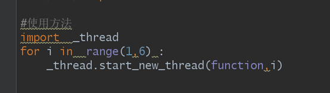
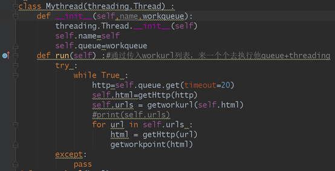
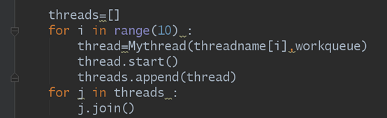
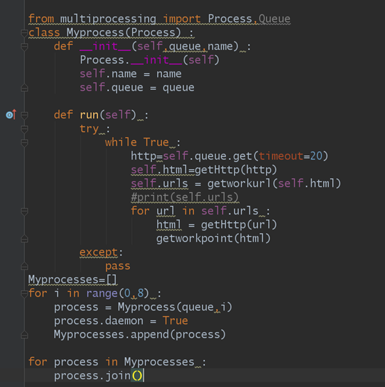
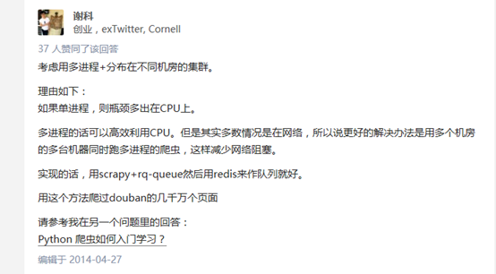
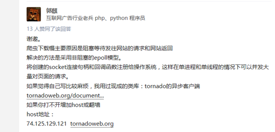
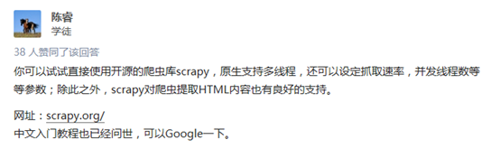
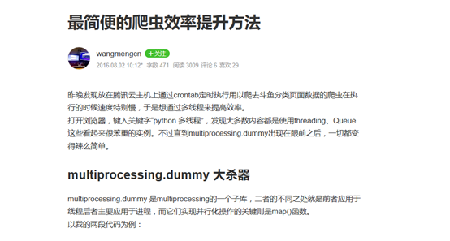

这里主要讲两个方法来提升爬虫速度以及如何优化
## 通过函数来产生方法
通过`_thread.start_new_thread()`来产生新的线程，括号里面要加的是函数名和一些参数



这个是比较低级的，自主添加性不高，不过可以用来临时做要求性不高的东西
## 通过模块来提高速度

### 通过threading模块来产生新的线程

模块里的常见方法
```
run():用来产生表示线程的方法
start():用来启动一个线程
join():只有当线程加载完时，才会接着主线继续执行下去
isAlive():如果线程还在运行就会返回一个True否则就会返回一个False
getName():获取一个线程的名字
setName()设置一个线程的名字
```
格式：






注：只要线程开始运行就会自动运行run方法，所以我们只要对run()方法进行重写就可以了最重要的就是run方法，如果说_thread（）函数与threading模块有什么不同，那就是threading里面得run方法能放很多函数，但是_thread()只能有一个函数
### 通过multiprocessing模块来产生新的进程

Multiprocessing模块的方法与threading的模块方法类似




爬虫得优化：使用queue队列型，这样就能做到自动结束，而不用向列表一样特别烦，queue一般使用：(queue模块的使用)
1、创建：
```
import Queue
myqueue = Queue.Queue(maxsize = 10)
```
2、将值放到队列里面：
```
myqueue.put(10)，

put()有两个参数，第一个item为必需的，为插入项目的值；第二个block为可选参数，默认为1。如果队列当前为空且block为1，put()方法就使调用线程暂停,直到空出一个数据单元。如果block为0，put方法将引发Full异常。
```
3、将一个值从列队里面拿出来
```
myqueue.get()调用队列对象的get()方法从队头删除并返回一个项目。可选参数为block，默认为True。如果队列为空且block为True，get()就使调用线程暂停，直至有项目可用。如果队列为空且block为False，队列将引发Empty异常。
今天爬虫事情暂停我还没写的爬虫速度优化有
```
### 使用pool+queue的多进程爬虫
### 多协程爬虫
还有的优化爬虫速度的方法：
[这些建议的url](https://www.zhihu.com/question/20145091)








[***为何大量网站不能抓取?\******爬虫突破封禁的6\******种常见方法\***](http://blog.csdn.net/kangqianglong/article/details/62430111)

[***最简便的爬虫效率提升方法\***](https://www.jianshu.com/p/789ed0b0ecae)




```
def insert_info():
    '''
    通过遍历游戏分类页面获取所有直播间
    '''
    session = requests.session()
    pagecontent = session.get(Directory_url).text
    pagesoup = BeautifulSoup(pagecontent)
    games = pagesoup.select('a')
    col.drop()
    for game in games:
        links = game["href"]
        Qurystr = "/?page=1&isAjax=1"
        gameurl = HOST + links + Qurystr
        gamedata = session.get(gameurl).text
        flag = get_roominfo(gamedata)
    aggregateData()

from multiprocessing.dummy import Pool

pool = Pool()

def insert_info():
    '''
    通过遍历游戏分类页面获取所有直播间
    '''
    session = requests.session()
    pagecontent = session.get(Directory_url).text
    pagesoup = BeautifulSoup(pagecontent)
    games = pagesoup.select('a')
    gameurl = [HOST + url["href"] + "/?page=1&isAjax=1" for url in games]
    col.drop()
    g = lambda link: session.get(link).text
    gamedata = pool.map(g, gameurl)
    ginfo = lambda data: get_roominfo(data)
    pool.map(ginfo, gamedata)
    aggregateData()


    aggregateData() 
```
同样通过Directory_url这一地址获取页面中所有标签<a></a>，然后通过pool.map(g, gameurl)完成'href'值的获取，最后再用一次pool.map(ginfo,gamedata)完成所有页面内容的提取和入库。再一次测试，只需要<strong>33.1s</strong>即可完成。
所以说，如果你的爬虫也要处理类似的过程，不妨尝试一下multiprocessing。
更多详细信息可以参考官方文档。


