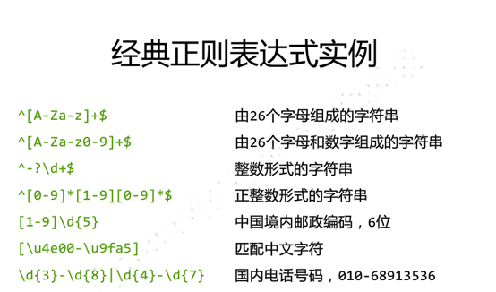
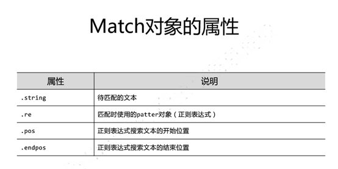
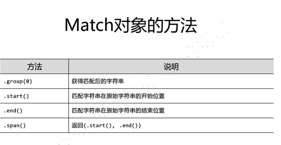
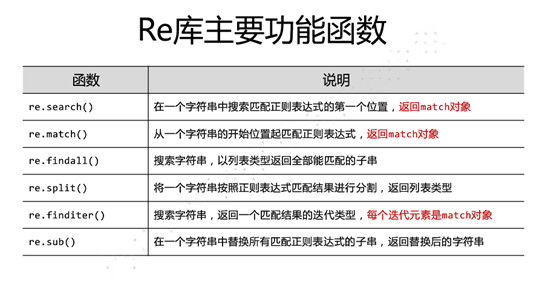
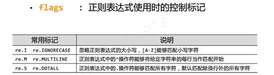
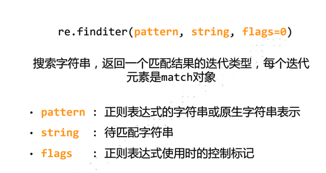
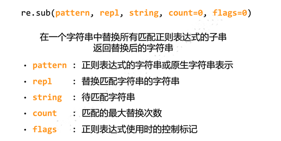
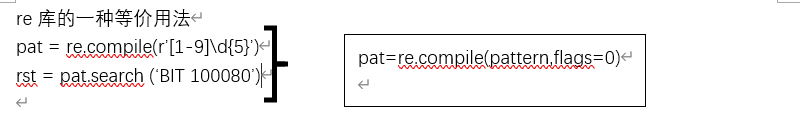
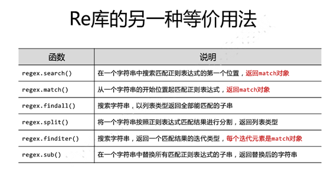
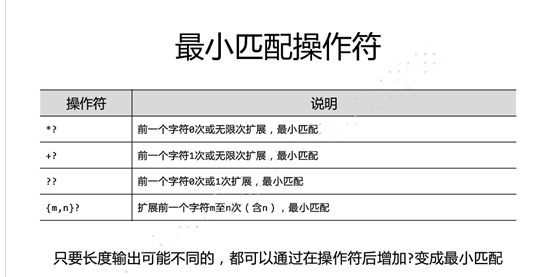

# Re查找

基于正则表达式的查找
正则表达式就是将r.textl里面的部分内容，或全部内容进行查找，摘出相应的字符串，所以正则表达式查找，输入和输出都是字符串
正则表达式的语法
正则表达式分为两种一种是r”(原生字符表达式)，还有一种string类型



正则表达式的使用方式
Match对象
Match是一次匹配的结果里面包含很多信息（和requestsli里面返回的Sponse对象一样，包含了很多信息）






Re库的主要功能函数



Re.search(pattern,string,flags=0)       返回match对象
Pattern是正则表达式的字符串或者是·原生字符。
String是待匹配的字符串
Flags是正则表达式使用时候的控制标记








re库的一种等价用法







最小匹配



返回的有match类型和string类型和列表类型


# Re正则

| \w   |      |
| ---- | ---- |
| \W   |      |
| \s   |      |
| \S   |      |
| \G   |      |
| \d   |      |
| \D   |      |
| \a   |      |
|      |      |
| \n   |      |
| \t   |      |
|      |      |
| ^    |      |
| $    |      |
| .    |      |
| […]  |      |
| [^…] |      |
| *    |      |
| +    |      |
| ?    |      |
| { }  |      |
| { }  |      |
| a\|b |      |
| ()   |      |

上面是常见的正则匹配规则，然后python对正则有个模块，现在来介绍这个模块的方法与属性

```
import re
```


其中pattern 是匹配规则，string是待匹配字符串，flag是匹配信号

 

## math()。

re.match(pattern, string, flags=0)，获取到的是一个匹配对象Match对象。其中Match有哪些属性？Match.group(1)获取到匹配的一个结果。Match.groupdict()以字典的形式返回匹配的第一个字符与最后一个字符。Match.start()以返货匹配的第一个字符的下标，和最后一个字符的下标

## search()。

与match（）基本一样唯一不同的是match不是匹配开头。

 

## finditer() 
```
finditer(*pattern*, *string*, *flags=0*)
```
与findall()差不多，但获取到的是Matchs

 

##   findall()
```
findall(*pattern*, *string*, *flags=0*)
​```获取到的是可匹配的字符列表

## sub()
```
sub(*pattern*,* repl*,* string*,* count=0*,* flags=0*)*
```
##   split()
```
split(*pattern*,* string*,* maxsplit=0*,* flags=0)
````
 
````