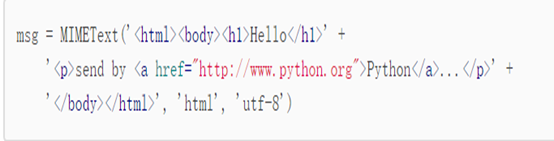
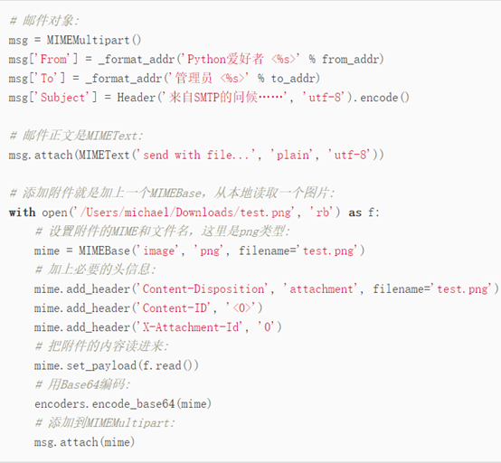
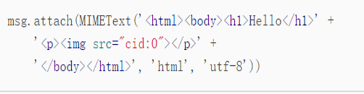
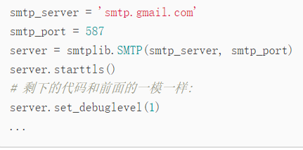
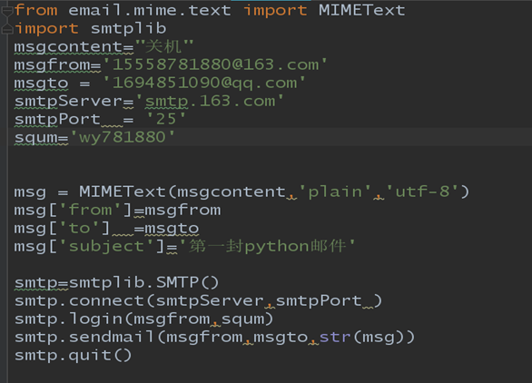
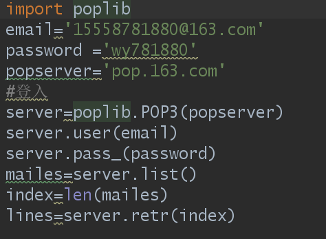
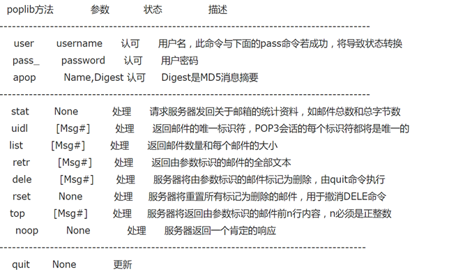

用哪两个包？python里面的`smtplib`和`email`两个模块，`Email`用来构造一封邮件，`email`负责邮件，`smtplib`用来发送邮件。其中目前最难的是如何编写一封邮件


# 如何构造一个纯文本？

这里用`MIMETText`类构造了一封信。
构造`MIMETText`里面要添加三个属性值，第一个参数是信的正文内容，第二个参数是信的类型（有三个值text/plain(纯文本) 、html（超文本））


# 如何附加信息

如何构造含有邮件主题、邮件发件人、邮件收件人加到电子邮件中？
```
msgFrom = '15558781880@163.com' #从该邮箱发送
msgTo = '15558781880@163.com' #发送到该邮箱
msg['from'] = msgFrom
msg['to'] = msgTo
msg['subject'] = 'Python自动邮件-'
```
最后一个是编码方式？一般是网络编码方式‘utf-8’

# 如何发送html超文本邮件？
方法很简单，在构造MIMEText对象时，把HTML字符串传进去，再把第二个参数由plain变为html就可以了：




四、如何发送正文的时候一起发送附件？

带附件的邮件可以看做包含若干部分的邮件：文本和各个附件本身，所以，可以构造一个`MIMEMultipart`对象代表邮件本身，然后往里面加上一个`MIMEText`作为邮件正文，再继续往里面加上表示附件的`MIMEBase`对象即可：




五、如何发送图片？
只要在这个`MIMEMultipart`总邮箱里面增加
`MIMEMultipart`的`MIMEText`从plain改为html，然后在适当的位置引用图片

 


# 如何使得一份邮件同时有plain和html？

用`email`构造邮件的方式已经完成，现在如何把这份邮件发出去？

发送

	

`Smtplib`实例相当于一个手机发送邮件的客户端
```
class smtplib.SMTP_SSL(host='', port=0, local_hostname=None, keyfile=None, certfile=None, [timeout, ]context=None, source_address=None)
```
参数解释：一个SMTP_SSL实例的行为与实例的行为完全相同 SMTP。SMTP_SSL应该用于需要从连接开始使用SSL并且使用starttls()不合适的情况。如果主机没有指定，则使用本地主机。如果 端口为零，则使用标准的SMTP-over-SSL端口（465）。可选参数local_hostname，timeout和source_address与它们在SMTP类中的含义相同。 上下文也是可选的，可以包含SSLContext和允许配置安全连接的各个方面。请阅读最佳实践的安全注意事项。
一些异常
其余异常查看文档：python3.6
`SMTP`对象

## 常见方法：
### connect
```
SMTP.connect（host ='localhost'，port = 0 ）
```
连接到给定端口上的主机。默认值是连接到标准SMTP端口（25）的本地主机。如果主机名以冒号（':'）后跟数字结尾，则该后缀将被剥离，并将该数字解释为要使用的端口号。如果在实例化过程中指定了主机，则此方法由构造函数自动调用。返回服务器在连接响应中发送的响应代码和消息的2元组。

### Login:
```
SMTP.login（user，password，*，initial_response_ok = True ）
```
登录需要验证的SMTP服务器。参数是用户名和密码进行身份验证。如果之前没有 EHLO或HELO命令此会话，则此方法EHLO 首先尝试ESMTP 。如果身份验证成功，此方法将正常返回

### Send
```
SMTP.sendmail(from_addr，to_addrs，msg，mail_options = []，rcpt_options = [])
```
（注意：to_addrs是一个列表，可以用来一次发给多个人，一个字符串会被当成列表中只有一个元素）

### Quit:
```
SMIT.quit()
```
用来结束smit的连接和这个实例。
栗子：



### Poplib(poplib也是创建一个收信的手机客户端)
我们通过获取+解析邮件来获取邮件内容
首先是连接 接着是登入账号，你的实例就变成了一个客户端

	

Poplib.POP3实例的常见



Python pop 解析邮件
