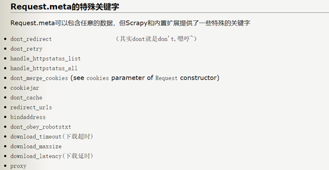
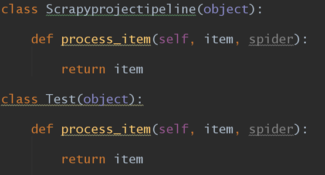

scrapy
scrapy命令


分别来说明：
bench 可以用来查看本机的爬取速度 scrapy bench
check  检查错误，测试爬虫是否合规.scrapy check spider_name
crawl  运行整个爬虫项目 scrapy crawl spider_name
	如果不想查看日志的话，就输入 scrapy crawl –-nolog spider_name
edit  用来编辑爬虫文件  
fetch 用来抓取一个url的网址 scrapy fetch url
genspider 用来生成爬虫文件  
scrapy genspider -l 用来查看有哪些爬虫版本可以生成
scrapy genspider -t basic spider_name url 用来生成一个基础的爬虫
setting用来查看setting.py中的配置  scrapy setting –get  setting_name
list用来查看一个爬虫项目中有几个爬虫文件 scrapy list
runspider 用来单独运行一个爬虫文件  scrapy runspider spider_name
shell 在命令行中打开交互界面 ，发出一个请求，获取到的是一个response.
	scrapy shell url
view 下载url的源码，并且展示出来， scrapy view url

入门：我们首先要知道的是框架是什么，框架就我认为是已经实现了逻辑关系，我们只要按照要求，在相应的位置填入相应的内容。scrapy框架就是如此。我们先来说下scrapy框架的逻辑


其中最重要的就是engine。
然后然后我们来说需要我们填写的各个部分，其中scrapy start scrapyproject  生成了一个文件夹，其中的文件就是我们需要修改的各个部分。我们先来看下这个文件夹的结构
```
scrapyproject/ 
scrapy.cfg
project/
	__init__.py
	items.py
	settings.py
pipelines.py
	middlewares.py
	spiders/
		__init__.py
```
这个就是文件夹的目录，其中的各个部分就是我们需要填写的。首先我们从spiders文件夹开始说，这个文件夹是专门放爬虫文件。如何生成爬虫文件？scrapy genspider spider 网址
生成的spider如下图所示:


图中出现的是最基本的四个属性与方法。其中start_urls会将列表中的网址依次传给start_requests.其中比较重要的是生成的request请求和返回的response有哪些属性与方法？
request有这些属性与方法，headers,body,cookies,meta这些


其中meta又有哪些值？



[这篇文章还不错](https://www.cnblogs.com/thunderLL/p/6551641.html)
response的属性与方法


那如何获取到网页源码呢？可以这样写response.body.decode(response.encoding)
还有总不可能一个爬虫文件只写一个parse函数把，因此如何跳转到其他函数，这里就要用scrapy.Request中的回调函数callback,当scrapy.Request完成了请求生成了response，就会将response作为回调函数的参数传递给回调函数。那有哪些方式可以传递参数给回调函数？可以通过request的meta来传递参数。
然后是downloadermiddleware spidermiddleware和itme pipeline
用下面这幅图就好理解了
其中1是Pipeline， 2是spider middleware ，3是downloader middleware


middlewares.py其中包括downloader middleware和spider middleware。其中downloader middleware怎么写，自己写的downloader middleware只要实现几个方法就行了，如：process_request(request,spider)、process_response(request,response,spidr)和process_sxception(request ,excetion，spider)其中关于这三个方法这篇文章蛮不错的 如：下面就是运用downloader middleware 来换request的headers.

这三个方法我是这样理解的process_request(request,spider)是下载前，就是请求还没有发到Downloader。而process_response(request,response,spidr)则是当response从DownLoader返回response，同是注意的是返回response的同时也会返回生成这个response的request。我猜是这样如果返回的response自己不满意可以返回这个请求接着去再访问。
而spideermiddle用的不太多，以后再考虑。那怎么用middlewave，这个就要涉及到setting关于middlewave这个就是在setting去掉注释：

```
DOWNLOADER_MIDDLEWARES{

 }
```

pipeline.py这个文件中放的是对item的处理方式：
一个Pipline有以下四个方法process_item(),open_spider,from_crawl(),close_spider()

格式：
```
class ScrapydownloadertestPipeline(object): 
	def process_item(self, item, spider): 
		return item
```
而item是一种数据结构，侧重于定义如何在同一个文件中写两个item，就是要保证item中item取名要和pipline相同，即如下图所示：
items.py


pipline.py



如果如下图所示就不能运行：

