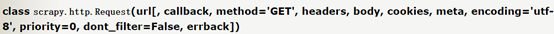
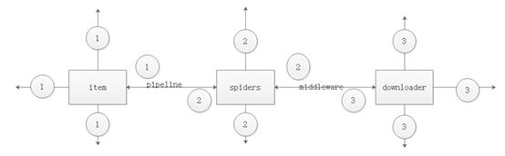
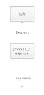

scrapy
scrapy命令


分别来说明：
+ bench 可以用来查看本机的爬取速度 scrapy bench
+ check  检查错误，测试爬虫是否合规.scrapy check spider_name
+ crawl  运行整个爬虫项目 scrapy crawl spider_name
 如果不想查看日志的话，就输入 scrapy crawl –-nolog spider_name
+ edit  用来编辑爬虫文件  
+ fetch 用来抓取一个url的网址 scrapy fetch url
+ genspider 用来生成爬虫文件  
+ scrapy genspider -l 用来查看有哪些爬虫版本可以生成
+ scrapy genspider -t basic spider_name url 用来生成一个基础的爬虫
+ setting用来查看setting.py中的配置  scrapy setting –get  setting_name
+ list用来查看一个爬虫项目中有几个爬虫文件 scrapy list
+ runspider 用来单独运行一个爬虫文件  scrapy runspider spider_name
+ shell 在命令行中打开交互界面 ，发出一个请求，获取到的是一个response.
 scrapy shell url
+ view 下载url的源码，并且展示出来， scrapy view url

入门：我们首先要知道的是框架是什么，框架就我认为是已经实现了逻辑关系，我们只要按照要求，在相应的位置填入相应的内容。scrapy框架就是如此。我们先来说下scrapy框架的逻辑


其中最重要的就是engine。
然后然后我们来说需要我们填写的各个部分，其中scrapy start scrapyproject  生成了一个文件夹，其中的文件就是我们需要修改的各个部分。我们先来看下这个文件夹的结构
```
scrapyproject/ 
scrapy.cfg
project/
	__init__.py
	items.py
	settings.py
pipelines.py
	middlewares.py
	spiders/
		__init__.py
```
这个就是文件夹的目录，其中的各个部分就是我们需要填写的。首先我们从spiders文件夹开始说，这个文件夹是专门放爬虫文件。如何生成爬虫文件？scrapy genspider spider 网址
生成的spider如下图所示:


图中出现的是最基本的四个属性与方法。其中start_urls会将列表中的网址依次传给start_requests.其中比较重要的是生成的request请求和返回的response有哪些属性与方法？
request有这些属性与方法，headers,body,cookies,meta这些



其中meta又有哪些值？


[这篇文章还不错](https://www.cnblogs.com/thunderLL/p/6551641.html)
response的属性与方法

那如何获取到网页源码呢？可以这样写response.body.decode(response.encoding)
还有总不可能一个爬虫文件只写一个parse函数把，因此如何跳转到其他函数，这里就要用scrapy.Request中的回调函数callback,当scrapy.Request完成了请求生成了response，就会将response作为回调函数的参数传递给回调函数。那有哪些方式可以传递参数给回调函数？可以通过request的meta来传递参数。
然后是downloadermiddleware spidermiddleware和itme pipeline
下面就是个人对scrapy理解的图



其中

```
1是pipeline item 
2是spider middleware 
是downloader middlerware.
```
由于2基本不会怎么用到这里就来讲`item`,`spiders`，`item pipeline downloadermiddlerware`.

item 
item，创建的item需要继承scrapy.Item类。，其中的对象需要定义类型为scrapy.Field的字段。
比如这个例子
class QuoteItem(scrapy.Item){
	text=scrapy.Field()
从这里我们可以看出Item是类，这就可以用isinstance来判断类型。
spider
普通的scrapy是继承basic。即scrapy.Spider。
这里先放出一个有基本属性的爬虫来，再来讲爬虫的基本属性
```
# -*- coding: utf-8 -*-
import scrapy
import json
from scrapy.spiders import Request

from scrapyproject.items import ScrapyprojectItem
class ZhaopinSpider(scrapy.Spider):
    name = 'zhaopin'
allowed_domains = ['zhaopin.com']
/*start_urls=[‘https://fe-api.zhaopin.com/c/i/sou?pageSize=10’]*/
    def start_requests(self):

        for i in range(1,10):

url = 'https://fe-api.zhaopin.com/c/i/sou?pageSize=%d'%(i*10)

yield Request(url=url)

    def parse(self, response):
    	pass
```
+ name是爬虫的名字。allowed_domains是允许爬取的域名，是可选配置，如果去掉，就能够爬全网。
+ custom_settings是一个字典，可以覆盖原本的项目全局的配置
+ start_requests和start_url这两个里面智能出现一个。道理是一样的。start_url里面的url会一个一个的发送到start_requests中。
+ parse()这个是当Response没有回调函数，该方法默认会被覅用，对了scrapy中自己写的处理爬虫数据的方法只有三种结果。Request,item,None。
+ closed这个是当Spider关闭是，该方法会被自动调用
+ 这里来讲一下yield出去的Request 这里就是官方的Request对象。我们zhe李需要运用的是url,与callback.
+ response，首先来讲一下response与Selector。这里需要理解的是xpath与re在response上的体现。如何使用xpath只要response.xpath(“//a”)就能获取到xpath对象那么如何获取到节点信息需要用到的是extract_first()与extract()。如response.xpath(“//a”).extract(),response.xpath(“//a”).前者只有第一个元素，后者获取到的是一个可迭代列表。re正则匹配又如何使用？只要在xpath后使用即可。response.xpath(“XXX”).re(xx)(其中后面的xx是正则表达式其实正则匹配也是有两个re_first()与re())

pipeline item。

自定义Item Pipeline。其实很简单只要定义一个类，这个类是需要有几个方法。分别是open_spider(spider),close_spider(spider)，from_crawler(spider,crawler)，还有一个必须的方法就是process_item(item,spider).其中open_spider(spider),是再spider开始运行时执行的，close_spider(spider)是再spider停止运行后，进行的。这两个方法有什么好处。比如说你要将数据存到数据库中，总不能每次调用一下这个Item Pipeline就执行这个连接和断开数据库的工作吧。所以可以将连接数据库open_spider(spider)，关闭数据库放在close_spider(spider)。然后处理数据就由process_item(item,spider)来执行。对了，有一个爬虫项目肯定不可能只有一个pipeline item 那么我们加入我们有两个item ,现在分别对这两个item，分别写了两个Item pipeline。那么我们应该怎么区别哪个item pipeline处理哪个item。这里就用到了前面的isinstance。只要用isinstance(object,class)根据返回的True或者False.就能知道是不是用这个Pipeline来处理这个Item.

Downloader middleware

这个我们也可以重新只要有三个方法就行了，分别是process_request(request,spider)、process_response(request,response,spider)(应该会有人好奇为什么response，还需要request。这是因为当response不符合需要的要求时候，我们可以选择将request生成新的Request，返回队列和process_exception(request,exception,spider)
上面三种方法对放回不同的值会有什么处理方式：
process_request(request,spider)


当返回是None时，Scrapy会继续处理该Request，去执行其他Downloader Middleware的process_request()，一直当Downloader 返回执行得到的Response才借宿。这个过程中也就是修改Request的过程，可以修改Request的代理，cookie或者是代理。那么如何修改这些呢？修改头部，request.headers[“User-Agent’]=xx(user-agent)。修改cookie，request.cookies=xx(cookies)。修改代理request.meta[“proxy”]=xx(proxy)。
当返回的是response的时候，更低优先级的Downloader Middlerware的process_request与process_exception就不会被调用，被调用的只会是更低级的process_response(request,response,spider)会被调用。（刚好与前面的返回None对应）
当返回是Request对象时候，会将该request重新生成Request放入带爬取队列中。

process_response(request,response,spider)



当返回的是response的时候，更低级别的process_response会被继续被调用。
当返回是Request对象时候，会将该request重新生成Request放入带爬取队列中。
process_response(request,exception,spider)


这个函数方法触发得到条件是当process_request或者proccess_response出现Ignorerequest异常抛出就会依次进行process_response(request,exception,spider)。当返回值是None时候，更低级别的process_response(request,exception,spider)就会被执行，直到所有的process_response(request,exception,spider)被调度完毕。
当返回的是response的时候，更低优先级的Downloader Middlerware process_exception就不会被调用，被调用的只会是更低级的process_response(request,response,spider)会被调用。（刚好与前面的返回None对应）
当返回是Request对象时候，会将该request重新生成Request放入带爬取队列中.
归纳这三个方法就是当返回是None就会执行更低级别的本命方法，当返回值是response的时候就会执行更低级别的process_response。当返回值是request，就会将request生成Request，返回爬取队列。

