爬虫中一个高效率框架就是scrapy,爬取效率特别快，但是一台机子不管怎么搞都是快不上去的，因此就想到了scrapy当然可以做分布式爬虫，分布式爬虫只要完成节点间的通讯就可以了，但是scrapy有一样东西特别麻烦那就是,就是部署，比如100台机子，总不能每台都开sftp、ssh吧。这样子搞100次那不得很麻烦，而且假如要修改那不是很奔溃。
因此我们应该要解决两个问题，1、如何快速的布置项目.2、如何修改一个母代码，子代码也会修改。读完这篇文章，你能解决第一个问题。解决第一个问题的方法就是Gepray与spiderkeeper。前者是用Django，后者使用flask框架。这两个部署框架各有千秋。在介绍这两个框架之前我们还要说一下实现这两个框架的基础
scrapyd 这个是部署scrapy到服务器上的部署工具
这个是运行在你要部署的服务器上。(可以这样理解 d+scrapy。服务器得到scrapy.)
scrapyd（GITHUB地址）。只要我们在服务器上运行scrapyd，本地再通过命令行就能够部署scrapy到服务器上。scrapyd通过了一系列的HTTP接口，使得能够在本地对布置在服务器上的scrapy实现各种操作。
下面来说一下（服务器ip为47.100.202.235）
如何使用`crapyd`
安装 ：`ip3 install scrapyd`
做一个配置文件
```
mkdir /etc/scrapyd/
vi /etc/scrapyd/scrapyd.confi
```
配置内容在这里：https://scrapyd.readthedocs.io/en/stable/config.html#example-configuration-file 
## api接口
### `aemonstatues.json`

这个接口用来查看scrapy当前的服务和任务状态。我们可以用curl来请求这个接口
```
curl  http://47.100.202.235:6800/daemonstatus.json
```
返回结果  
```
	{"pending": 0, "finished": 0, "node_name": "i-uf68xge6r3ivl", "running": 0, "status": "ok"}
```

其中pending表示等待被调度的scrapyd任务，status表示当前的运行状态，finished表示已经完成的scrapy任务，running表示正在运行的scrapy任务

### addversion.json
这个接口是用来部署本地egg(scrapyd只接受egg文件，如何将scrapy项目打包成egg文件,下面会讲)

```
curl  http://47.100.202.235:6800/addversion.json -F project=project_name =F version=xx -F egg=@项目打包成egg的名字.egg
```

### schedule.json
用来实现任务的调度，比如执行某个爬虫scrapy
```
curl  http://47.100.202.235:6800/schedule.json -d project=project_name -d spider=spider_name
```
返回
```
{“status”:”ok”,”jobid”:”sqgwqegeet1yo81282t33r”}
```
其中status表示scrapy项目的启动情况。jobid表示当前正在运行的爬取任务代号
### cancel.json
表示取消摸个爬虫任务
```
curl  http://47.100.202.235:6800/cancel.json -d project=project_name -d job= sqgwqegeet1yo81282t33r 
```
需要传入两个参数 peoject，即项目名称。job表示任务代号。

### listprojects.json
```
curl   http://47.100.202.235:6800/daemonstatus.json返回正在运行的项目
```
### listspiders.json
```
curl http://47.100.202.235:6800/listspiders.json 
```
返回正在运行的爬虫项目的版本号

### listjobs.json
```
curl http://47.100.202.235:6800/listjobs.json 返回正在运行,运行结束，等待运行的爬虫项目的id
```
scrapyd API 是对scrapyd进行封装，用python去实现，这个以后看。

scrapyd-client 这个比scrapyd多了一个功能，后者是将egg文件部署到服务器上，

前者能
+ 将scrapy文件打包成egg文件
+ 打包好后部署到服务器上如何使用scrapyd-client.

因为要打包的是文件夹，所以肯定是进入文件夹打包。
进入到文件夹
修改scrapy.cfg中的[deloy]中的url。
修改成`http://被部署的服务器的ip:6800(比如url=http://47.100.202.235:6800)`
再scrapy项目根目录输入scrapyd-cdeloy如果有多台主机的话，修改scrapy.cfg如下所示：
```
[deloy:vm1]
url = http://xx.xx.xx.1:6800
project=project_name

[deloy:vm2]
url = http://xx.xx.xx.2:6800
project=project_name
```

最后输入命令
```
scrapy-deloy vm1
scrapy-deloy vm2
```
那scrapyd如何对接docker?

讲完了以上之后，来讲下Gerapy与spiderkeeper

## Gerapy

Gerapy与spiderkeeper就是，通过scrapyd-client来打包成egg文件。再用scrapyd的http端口来实现一些功能。

Gerapy(Github地址：https://github.com/Gerapy/Gerapy)，相对于spiderkeeper不足之处就是不能进行任务的定时运行。
如何使用Gerapy部署scrapy项目：
多台服务器 1台服务器运行gerapy,其他服务器运行scrapyd.
```
gerapy命令：
$ gerapy
Usage:
  gerapy init [--folder=<folder>]
  gerapy migrate
  gerapy createsuperuser
  gerapy runserver [<host:port>]
  gerapy makemigrations
````
如何创建gerapy

初始化： `gerapy init` (如果想要在哪个文件夹中创建的话，就加上这个文件夹，否则会在同层目录创建gerapy文件夹)
进入初始化的文件夹进行，数据库初始化 ` gerapy migrate`
运行` gerapy gerapy runserver ip:port`
然后就运行成功了。接下来来讲下gerapy图形化操作

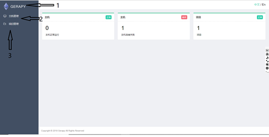

分别来讲下1、2、3三个操作界面

1、 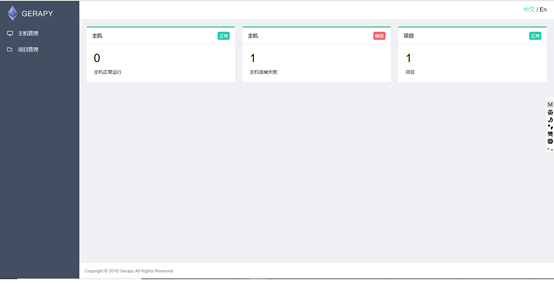

是一个浏览界面没有什么可以操作的。
2、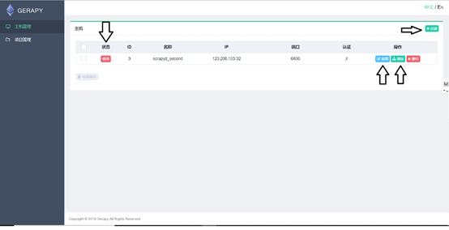


从左到右讲。状态表示和该节点（主机）的通讯情况，就是能不能将项目布置到这个节点上。一般只要这个节点运行了scrapyd和防火墙开放了端口号。就可以访问这个节点。这个节点就会显示连接，2、表示节点的配置信息，如下图所示：其中用户名和密码是如果用了ngix才需要填上去的，一般都不用填

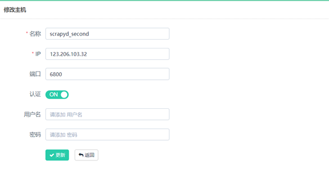

3表示该节点上爬虫的运行情况，如下图所示：

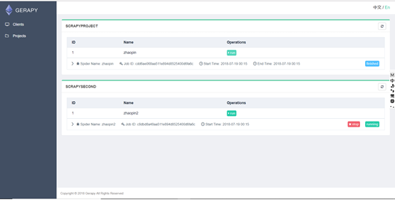

然后看第三部分

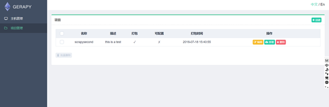


其中编辑比较有趣就是编辑项目的源码，每修改一次就会自动发送一个post请求。点击部署后会显示需要打包的信息，只要按钮就可以了。这个最方便的就是一次可以部署再多个节点，点击部署后如下图所示

还有如何把项目放到Project里面。很简单，之前我们gerapy init的时候再gerapy文件夹中回生成project这个文件。只要我们把scrapy拖到这个文件夹中即可。

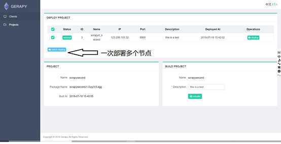


spiderkeeper.（github地址 https://github.com/DormyMo/SpiderKeeper）相对于gerapy来说这个的不足之处比较多。1，节点的布置比较麻烦，只能在每次启动spiderkeeper的时候，才能加节点。如果在运行中需要增加节点的化就只能重启的时候增加server列表里面的ip.2、不能修改源码，这个比较不好，就是每次修改源码的时候，需要自己打开idle.但是这个不足之处，也可以说被弥补了一部分，因为gerapyd必须要打开sftp或者是ssh把文件传到中心节点上才行。而这个spiderkeeper只要在浏览器上就可以进行这个操作。）
```
spiderkeeper.命令：
spiderkeeper [options]

Options:

  -h, --help            show this help message and exit
  --host=HOST           host, default:0.0.0.0
  --port=PORT           port, default:5000
  --username=USERNAME   basic auth username ,default: admin
  --password=PASSWORD   basic auth password ,default: admin
  --type=SERVER_TYPE    access spider server type, default: scrapyd
  --server=SERVERS      servers, default: ['http://localhost:6800']
  --database-url=DATABASE_URL
                        SpiderKeeper metadata database default: sqlite:////home/souche/SpiderKeeper.db
  --no-auth             disable basic auth
  -v, --verbose         log level
````

example:
```
spiderkeeper --server=http://localhost:6800
```
下载 
`pip3 install spiderkeeper`
启动

```
spiderkeeper –-host = xx.xx.xx.xx –port=xx(中心节点的ip和port,一般是直接在服务器上运行 –-host =0.0.0.0. –-port = 8000) –-username= xx –-password = xx –-server =http://其他节点的ip:其他节点运行scrapyd的端口
```
如：


现在来介绍图形化界面：


 

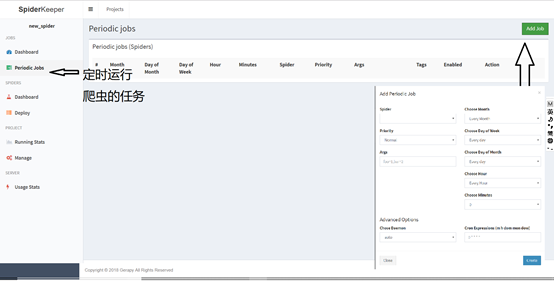

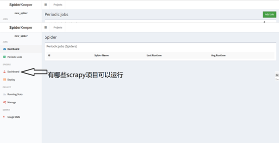


下图是上传egg文件，那如何生成egg文件？`https://github.com/scrapy/scrapyd-client `
如：在想要得到scrapy项目的egg的根目录下 `python C:\Users\asus\Anaconda3\Scripts\scrapyd-deploy  --build-egg output.egg`（想要得到egg的名字）

 

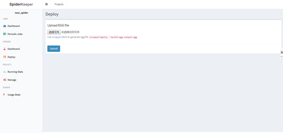

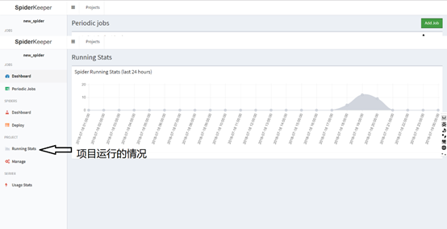

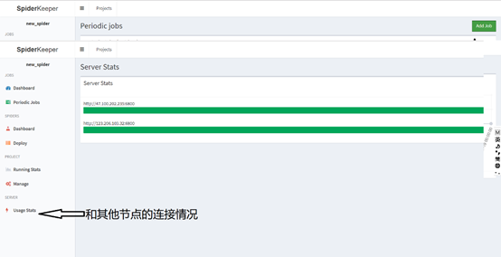


