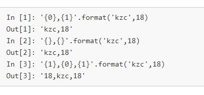
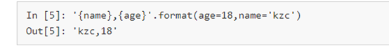
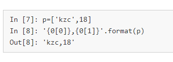
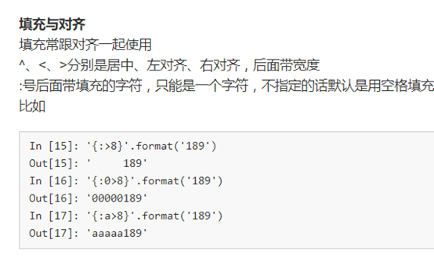
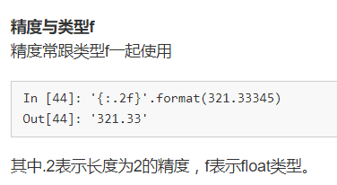
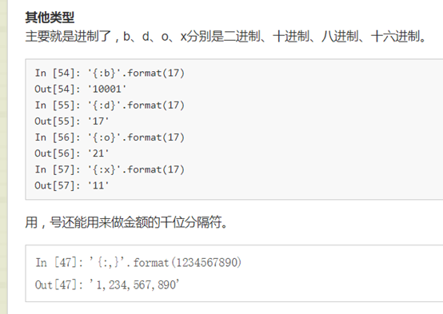

Format中通过{}和” : “ 来替代%。
Format前后的映射关系
通过位置



通过关键字



通过下标



格式限定符：
放在{}里面的

 





当中英文同时出现导致对不齐怎么办，用空格·
```
如： "{0:^10}\t{1:{3}^10}\t{2:^10}".format(u[0],u[1],u[2],chr(12288))
使用format模板：
 tplt = "{0:^10}\t{1:{3}^10}\t{2:^10}"
 print(tplt.format("排名","学校名称","总分",chr(12288)))
```