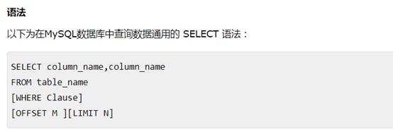

# 常见操作

## 连接：


## 建立库


或者 `create database basename`

## 删除数据库：


或者

`drop database basename`

删除数据库：


或者`drop database basename`

选择数据库


```
USE DATABSE DATABASEBANE(use database basename)
```
建立表


栗子：


删除数据表：


在表中加入数据


在表中提取数据




 删除数据:


修改数据：


删除数据：


where 是用来限制条件的。
like是模糊比较
union是将多张表一起联合输出


 ```
•	参数含义：
expression1, expression2, ... expression_n: 要检索的列。
•	tables: 要检索的数据表。
•	WHERE conditions: 可选， 检索条件。
•	DISTINCT: 可选，删除结果集中重复的数据。默认情况下 UNION 操作符已经删除了重复数据，所以 DISTINCT 修饰符对结果没啥影响。
•	ALL: 可选，返回所有结果集，包含重复数据。
 ```

# Python对mysql的操作

+ 连接
+ 做两种操作（是否会对源数据产生影响）

## 连接


两种操作：
不会对源数据产生影响就不用提交事务
会对源数据产生影响就必须提交事务


不管怎么样最后都要关闭连接


Pymysql也能操作从这个可以看出来

规范的提交一次数据代码：


# 使用ORM

是不是用pymysql特别麻烦，现在有一个特别简单的工具ORM,即sqlalchemy
下面来介绍sqlalchemy
连接sqlalchemy
http://docs.sqlalchemy.org/en/latest/core/engines.html#sqlalchemy.create_engine

## 连接


比如如这个
```
'mysql+pymysql://{}:{}@{}:{}/{}?charset=utf8'.format(USERNAME,PASSWORD,
HOSTNAME,PORT,DATABASE)
```

数据表
映射肯定是需要数据表的不然python里面的怎么实现和数据库中的一一对应。


然后是怎么映射到数据库，需要执行这一句语句

其中的base是怎么来的
```
from sqlalchemy.ext.declarative import declarative_base
```
执行完上面的语句后就是映射python类到数据表中了
然后需要对数据表进行操作，比如插入，查找，更新，删掉。首先这些操作都是在session中进行的。session这里解释一下就是理解成数据库与python构建成的一条通道，任何对数据表的操作都要经过这里。
如何构建一个session
两种方法
```
from sqlalchemy.orm import sessionmaker
Session=sessionmarker(bind=engin)
```
或者
```
Session=sessionmarker()
Session.configure(bind=engine)
```
但是最后都要
```
session=Session()
```
插入
插入肯定插入的是一个数据表字段，那怎么生成一个数据表字段
```
ed_user = User(name='ed', fullname='Ed Jones', password='edspassword')
```
这样ed_user就是一个字段
然后提交
```
session.add(ed_user)
session.commit()
```
那么如何一次增加多个字段
```
session.add_all([
...     User(name='wendy', fullname='Wendy Williams', password='foobar'),
...     User(name='mary', fullname='Mary Contrary', password='xxg527'),
...     User(name='fred', fullname='Fred Flinstone', password='blah')])
```
用session.add)all([,])将字段变成列表的形式。
脏（dirty）数据与新（new）数据:二者得到区别在于是否对session进行了commit()
如果没有进行commit。那么数据表中的信息就没有发生改变。session.dirty
如果进行了commit。那么数据表中的信息就是已经进行了更新。session.new
如下面
```
>>>session.dirty
IdentitySet([<User(name='ed', fullname='Ed Jones', password='f8s7ccs')>])
>>>session.new
IdentitySet([<User(name='ed', fullname='Ed Jones', password='f8s7ccs')>])
```
回滚
```
session.rollback()
```
查询
这里要涉及到
`query（）`,查找是通过session的query方法。这里有两种查查找，`session.query(User,User.id).all()`和`session.query(user).order_by(User.id).all()`。这两种的sql语句如下所示
比如`session.query(User).order_by(User.id)`等价于sql语句
```
SELECT users.id AS users_id,
        users.name AS users_name,
        users.fullname AS users_fullname,
        users.password AS users_password
FROM users ORDER BY users.id
```
这个的意思是按照user.id进行排序后输出。
```
session.query(User,User.id)
SELECT users.name AS name_label
FROM users
```
可以看出前者是按照id字段排序获取到的是整个字段。后者是获取到一部分字段。比如这里获取到的是`user.id`.
切片查询。这个query也是能够进行切片查询，如下所示：
```
>>> >>> for u in session.query(User).order_by(User.id)[1:3]:
...    print(u)
```
过滤查找。
这个才是核心。因为我们查找数据库，肯定是获取数据表中的某几条数据这里是采用query的filter().可以多次利用filter进行多次限制，如下所示：
```
session.query(User).filter(User.name=='ed').filter(User.fullname=='Ed Jones'):
```
过于`filter()`这里有三种过滤方式：
等于过滤，获取等于某些值得记录
```
query.filter(User.name == 'ed')
```
不符合过滤，当不符合某些要求是才会获取
```
query.filter(User.name != 'ed')
```
模糊查找，这个是mysql里面比较有意思的
不忽视大小写
````
query.filter(User.name.like('%ed%'))
```
忽视大小写
```
query.filter(User.name.ilike('%ed%'))
```
列表匹配 in
```
query.filter(User.name.in_(['ed', 'wendy', 'jack']))
```

# works with query objects too:

```
query.filter(User.name.in_(
    session.query(User.name).filter(User.name.like('%ed%'))
))
```
自然有in 了，就会有not in。这里的not in 是在filter()条件里面加入~
```
query.filter(~User.name.in_(['ed', 'wendy', 'jack']))
```
逻辑符号AND，OR 
```
from sqlalchemy import and_
query.filter(and_(User.name == 'ed', User.fullname == 'Ed Jones'))
from sqlalchemy import or_
query.filter(or_(User.name == 'ed', User.name == 'wendy'))
```
就是`session.query(表).filter(条件).order_by(排序)`
获取查询到的列表知乎，但是你只想要一个，或者想要全部怎么搞？在最后加上all(),first() 或者one()


删除 delete
```
>>> a = session.query(Article).get(10)
>>> session.delete(a)
>>> session.commit()
```
更新 update(查询后再提交)
```
>>> >>> a = session.query(Article).get(10)
>>> a.title = 'My test blog post'
>>> session.add(a)
>>> session.commit()
```
以上是一张数据表，但是如果有两张数据表想关联起来怎么搞？
外键
一对多外键
这里只需要两步，在创立数据表时候，先在两张表中创建关系，再创建外键就可以了。可以理解成一对多关系肯定是先创建关系了，才能添加外键
如何创建一张表与其它表的关系 `name=relation（“Tablename”）`
如何创建外键 `keyname=Column(Type,Foreignkey(“tablename.keyname”)`
```
class User(Base):

    __tablename__ = 'users'

    id = Column(Integer, primary_key=True)
    username = Column(String(64), nullable=False, index=True)
    password = Column(String(64), nullable=False)
    email = Column(String(64), nullable=False, index=True)
B   articles = relationship('Article')

class Article(Base):

    __tablename__ = 'articles'

    id = Column(Integer, primary_key=True)
    title = Column(String(255), nullable=False, index=True)
    content = Column(Text)
    user_id = Column(Integer, ForeignKey('users.id'))
A   user= relationship('User')
```
`User`可以通过`articles`来访问到`Article.Article`是通过`user_id`来一一对应。`Article`通过`user`来访问`User`
简便的写法
去掉A处代码，在B处代码贴上backref
如下


```
class User(Base):

    __tablename__ = 'users'

    id = Column(Integer, primary_key=True)
    username = Column(String(64), nullable=False, index=True)
    password = Column(String(64), nullable=False)
    email = Column(String(64), nullable=False, index=True)
    articles = relationship('Article'，backref=‘user’)

class Address(Base):
...     __tablename__ = 'addresses'
...     id = Column(Integer, primary_key=True)
...     email_address = Column(String, nullable=False)
...     user_id = Column(Integer, ForeignKey('users.id'))
...
...     user = relationship("User", back_populates="addresses")
```

如何在通过外键添加数据
```
>>> jack = User(name='jack', fullname='Jack Bean', password='gjffdd')
>>> jack.addresses
>>> jack.addresses = [
...                 Address(email_address='jack@google.com'),
...                 Address(email_address='j25@yahoo.com')]
>>> session.add(jack)
>>> session.commit()
```

外键的获取
```
>>> jack = session.query(User).\
... filter_by(name='jack').one()
>>> jack.addresses
```
外键的查找
```
session.query(User, Address).\
... filter(User.id==Address.user_id).\ ... filter(Address.email_address=='jack@google.com').all():
```
这样使用起来是不是特别玛法，我们可以使用join来。


```
>>> session.query(User).join(Address).\
...         filter(Address.email_address=='jack@google.com').\
...         all()

```