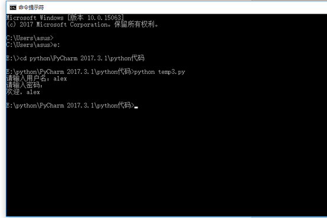
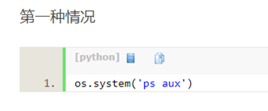
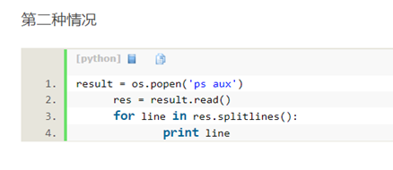
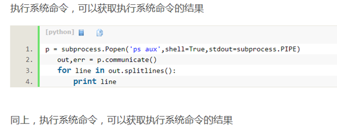
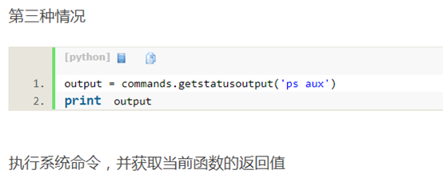
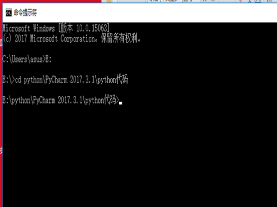
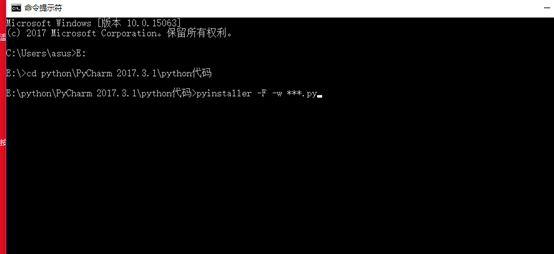
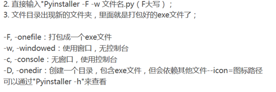

如何在命令行下运行python文件？
1.	先到达改python文件下
2.	在再文件命令行后加上python （文件名）.py就行了
栗子：

Python输出语句到cmd中
python执行系统命令后获取返回值的几种方式

执行系统命令，没有返回值

执行系统命令，按行输出返回值

如何通过命令行方式将python程序封装成exe程序
1、	先到达python所在的文件夹中

通过pyinstaller程序和其属性：

Pyinstaller有哪些常见的属性？

[官方翻译文章](http://blog.csdn.net/mr__fang/article/details/7176731)

python与命令行参数
首先如果要用到命令行参数就要导入sys这个库 即import sys

