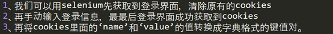
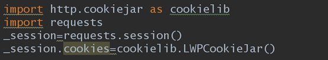
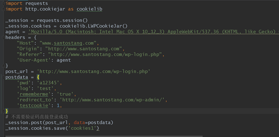
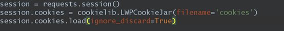
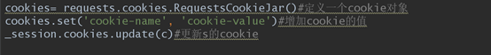
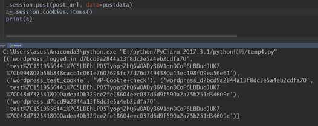
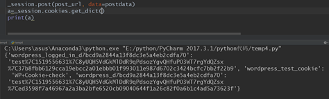
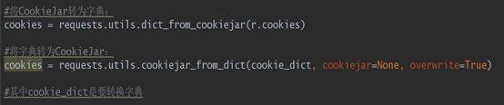
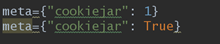

我知道的有三个地方与cookies有关
1、	selenium
2、	requests(高级的session()方法)
3、	scrapy

我们如何得到cookies?
一、	Selenium，Selenium操作cookies有4个方法

```
get_cookies(): 获得所有cookie信息。
get_cookie（name）：返回字典的key为name的cookie
add_cookie(cookie_dict):添加cookie。“cookie_dict”指字典对象，必须有name和value值。
delete_cookie(name,optionsString):删除cookie信息。“name”是要删除的cookie的名称。“optionsString”是该cookie的选项，目前支持的选项包括“路径”，“域”
delete_all_cookies():删除所有cookie信息。
```
那我们如何获取登录所需要的cookies信息？




实现代码


二、	requests(高级的session()方法)
requests可以看成一次对网页的无痕浏览，session可以看成一次普通状态下的浏览器。
Requests对cookies的操作session都能做，而session对cookies的操作requests却不能完成，虽说session是对requests的继承。因此我们这里只讲requests对session的操作。
如何获得cookies？
第一种方法是把cookies变成 LWPCookieJar类型,cookies进行加载和存储。
首先转换类型




这样_session就会增加save()和load()两个方法
如何通过session获得cookies?
代码：




如何把LWPCookieJar类型的cookies加到session里面,用login()方法：



追加cookies:




这里面加载的cookies是LWPCookieJar类型。
第二种方法获得其他类型的cookie数据：
列表类型：




字典类型：




LWPCookieJar类型与字典类型的相互转换：




三、	scrapy和cookies
要明白下面两者的区别




meta={'cookiejar':1}表示这个请求的cookiejar是几，下次要调用这个cookiejar时候，只要写上这个value就能调用相对应的cookiejar
meta={'cookiejar':response.meta['cookiejar']}表示使用上一次response的cookie，写在FormRequest.from_response()里post授权
meta={'cookiejar':True}表示使用授权后的cookie访问需要登录查看的页面

cookies除了可以用在登录时候，有时候cookie里面的东西也许会被js拿过来添加到postdata中。


