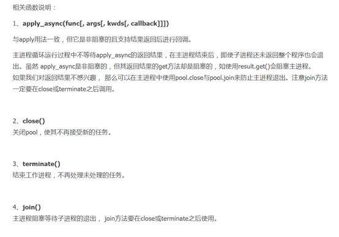
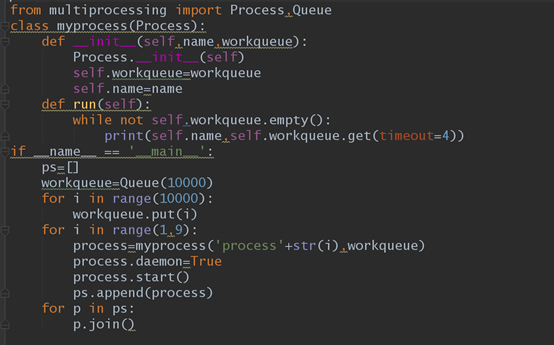
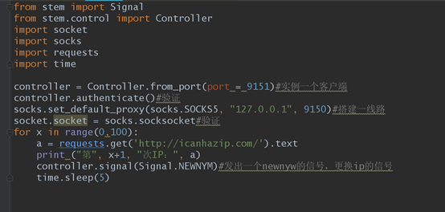

我们要明白两队关系：异步与同步，并发与并行
我们把进程内的这些“子任务”称为线程（Thread）。
多进程：
Unix/Linux下，可以使用fork()调用实现多进程。
要实现跨平台的多进程，可以使用multiprocessing模块。
进程间通信是通过Queue、Pipes等实现的。
`Multiprocessing`
守护进程：
默认情况下，创建的子进程非守护进程，既主进程如果执行完毕的，而子进程没有执行完毕，主进程会等待子进程执行完毕后再退出。
及设置`deame=True`

```
p.daemon = True
p.start()
```
相关方法：




多进程举例：



更换ip




我们可以用线程来写一个获取可用IP的的线程分支
注意
Python 多进程默认不能共享全局变量，因此我们只能用停止主线程来运行其他线程
```
#如果一定要运行多进程的话可以通过
#（multiprocessing.Value("d",10.0)，数值）
# （multiprocessing.Array("i",[1,2,3,4,5])，数组）
# （multiprocessing.Manager().dict()，字典）
# （multiprocessing.Manager().list(range(5))）。
# 进程通信（进程之间传递数据）用进程队列（multiprocessing.Queue()，单向通信），
# 管道（ multiprocessing.Pipe() ，双向通信）。
```
但是这个管道不适合查找IP
原因：

